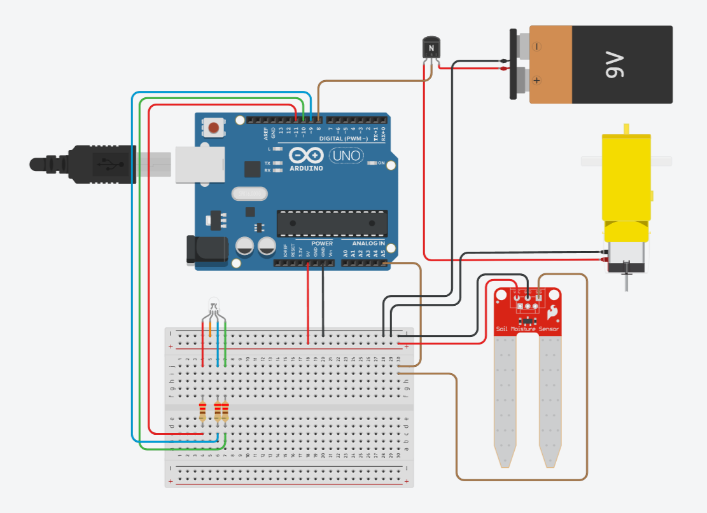
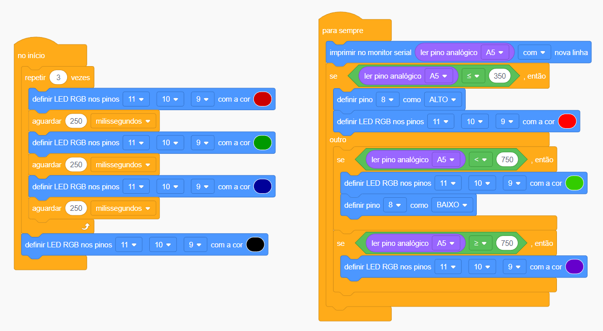

# Regador_automatico
Projeto de regador automático

No TinkerCad, crie o circuito conforme a imagem abaixo*:

<a href="Regador_automatico/Regador_automatico.ino">Clique aqui para o código</a>

Na programação em blocos, faça assim:

*Para utilizar este circuito físico deve-se utilizar uma mini bomba d'água no lugar do motor amarelo da imagem.
